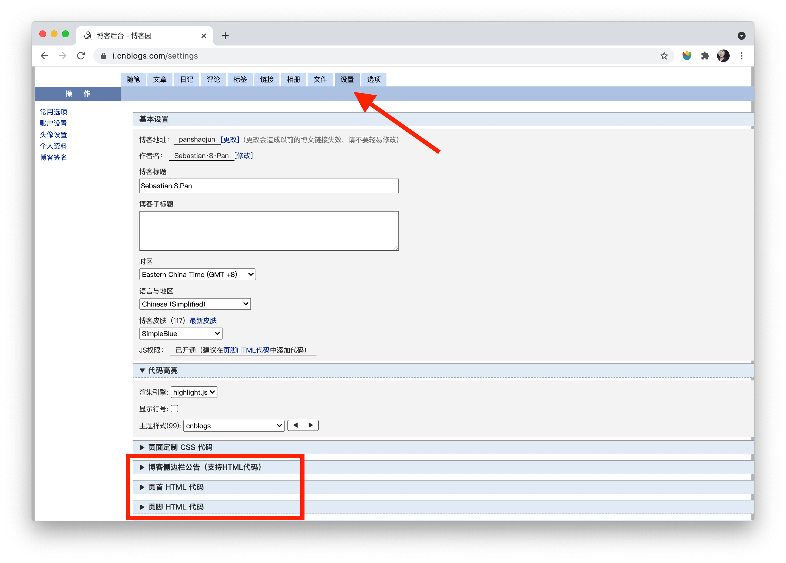

# 给博客园侧边栏随笔分类分组

## 一、前言
哇，真的是对博客园侧边栏很很不爽了，只能分类而不能进行分组。
这样要么导致分类增多，要么很多的随笔只能在同一个分类下面。
我能忍？我不能忍呐！所以开了这么个项目对博客园侧边栏进行修改

## 二、功能简介
可以根据自己的设置给分类分组，设置格式可以查看这个文件[baseMenu.ts](./src/config/baseMenu.ts)：
+ 有`chirld`的是自定义分组名称，也就是效果图中黑色部分，不可以点击
+ 没有`chirld`的是博客园中你自己的分类命名，程序会自动根据名称匹配获取url，并渲染成 a 标签

实际效果可以去我的博客园查看：[我的博客园](https://www.cnblogs.com/panshaojun/),以下是效果截图:


## 三、使用
如下进行打包：
```
npm run build
```
打包后，在博客园后台设置（需要申请js权限）界面，将项目 `dist/main.js` 中的代码以  `<script>` 标签包裹，放进任意一个可以撰写HTML的设置中，点确认即可


## 四、其他
### 4.1 代码逻辑
根据生成的侧边栏信息，匹配自定义设置的菜单，然后重新渲染覆盖该侧边栏。

### 4.2 未匹配提示
博客园中未匹配到 config 中的菜单，或者菜单中的设置未完全匹配，你都可以在控制台看见

### 4.3 优化设置
你可以将设置`baseMenu.ts`以js的方式，挂载在全局对象上，这样不用重新构建项目来更新博客园设置了