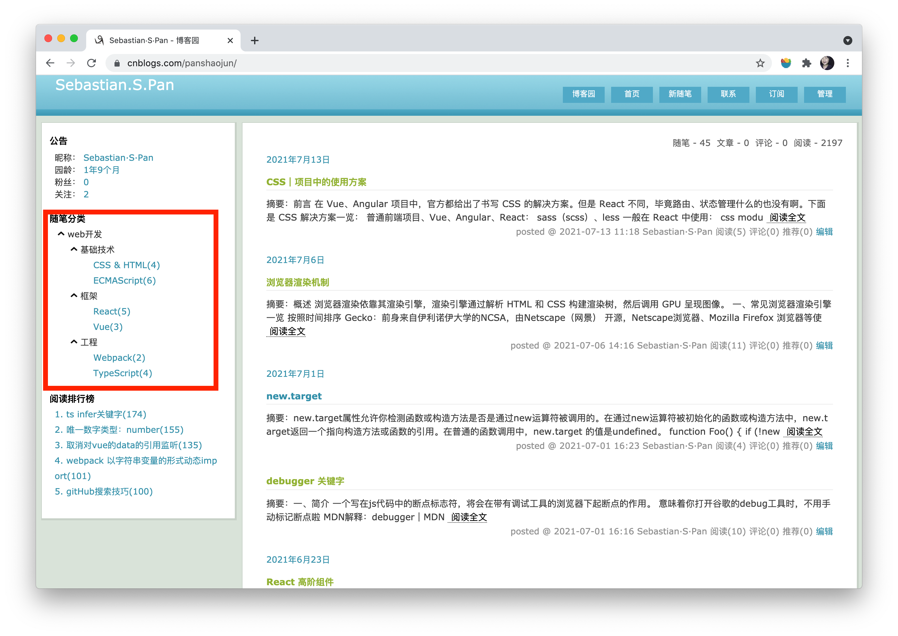

# 给博客园 侧边栏随笔分类 分组

## 前言
哇，真的是对博客园侧边栏很很不爽了，只能分类而不能进行分组。
这样要么导致分类增多，要么很多的随笔只能在同一个分类下面。
我能忍？我不能忍呐！所以开了这么个项目对博客园侧边栏进行修改

## 功能简介
可以根据自己的设置给分类分组，设置格式可以查看这个文件[baseMenu.ts](./src/config/baseMenu.ts);
然后，根据效果就会出现如下效果:



## 工作逻辑
根据生成的侧边栏信息，匹配自定义设置的菜单，然后重新渲染改写该侧边栏。

# 使用
如下进行打包：
```
npm run build
```
打包后，在博客园后台设置（需要申请js权限），将代码拷到相应的位置

# 其他
## 未匹配提示
博客园中未匹配到 config 中的菜单，或者菜单中的设置未完全匹配，你都可以在控制台看见

## 更改设置
你可以将设置`baseMenu.ts`以js的方式，挂载在全局对象上，这样不用重新构建项目来更新博客园设置了